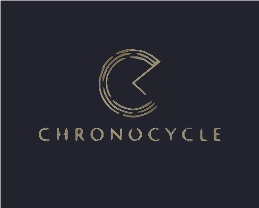

  

  <h3 align="center">ChronoCycle</h3>

  

    Project assigned by Murdoch University for the purpose of ICT302 IT Professional Practice Project 
     
    <a href="https://github.com/dixslyf/chrono-cycle">View Demo</a>
    ·
    <a href="https://github.com/dixslyf/chrono-cycle/issues">Report Bug</a>
    ·
    <a href="https://github.com/dixslyf/chrono-cycle/issues">Request Feature</a>
  

